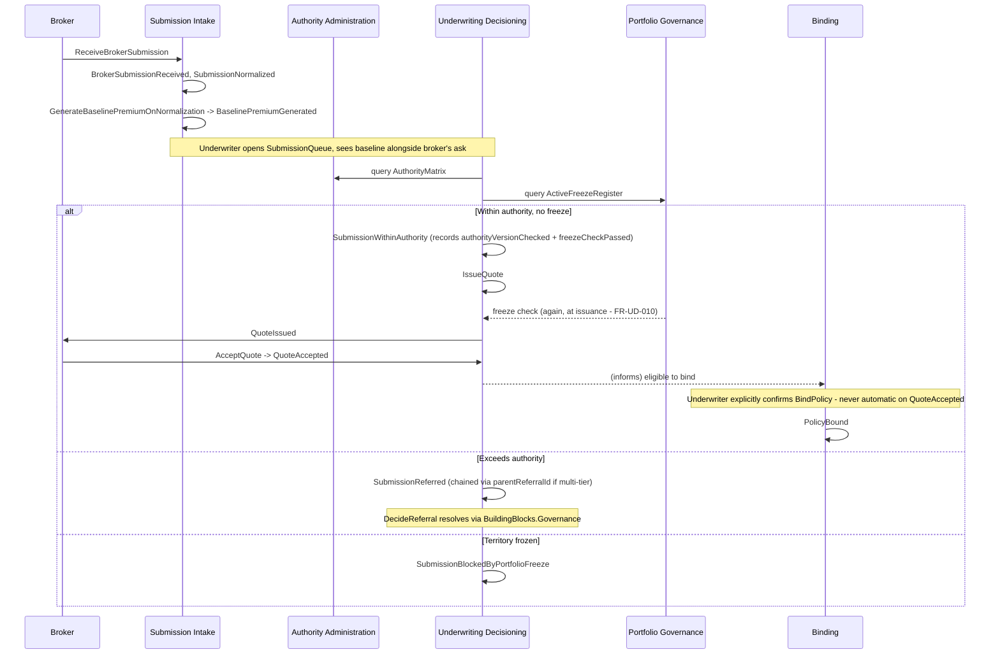
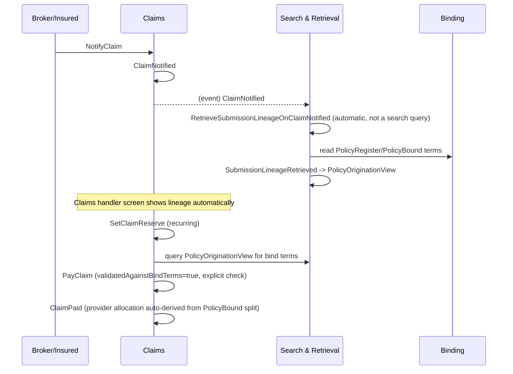
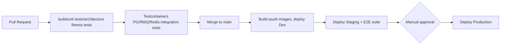

# High-Level Design (HLD) — Broker Connect (Pine Walk Underwriting Prototype)

Every module below is a direct rendering of a chapter already built on the event-modelers board — key slices, published/consumed events, and field shapes all trace back to `scenarios.md` and the live board, not invented for this document. See `Solution Arch/03-solution-architecture.md` for the architectural decisions (ADR-001 through ADR-018) this design assumes.

## 1. Module-by-Module Design

### 1.1 Authority Administration (Context 0 — confirmed)
**Purpose:** Governance/reference data underpinning the Provider → Cell → Underwriter authority cascade — one of the two gates into Underwriting Decisioning, and a cross-cutting engine reused by Binding and Claims.

| Aspect | Design |
|---|---|
| Storage | Event-sourced: `AuthorityLimit` aggregate (`CellAuthorityLimitGranted`, `UnderwriterAuthorityLimitGranted/Rejected`, `AuthorityLimitRevised`, `AuthorityLimitRevoked`); projections `CellAuthorityRegister`, `UnderwriterAuthorityRegister`, `AuthorityMatrix` |
| Key slices | `GrantCellAuthorityLimit`, `GrantUnderwriterAuthorityLimit`, `ReviseAuthorityLimit`, `RevokeAuthorityLimit`, `RequestCellAuthorityIncrease` |
| Publishes | `CellAuthorityLimitGranted`, `UnderwriterAuthorityLimitGranted`, `UnderwriterAuthorityLimitRejected`, `AuthorityLimitRevised`, `AuthorityLimitRevoked`, `InFlightSubmissionReassessed`, `CellAuthorityIncreaseRequested` |
| Consumes | — (top of the gate chain) |
| Notes | Houses the canonical `AuthorityMatrix` read model that Underwriting Decisioning queries at every assessment (FR-UD-001/002). `ReassessInFlightSubmissionsOnRuleChange` automation lives here, triggered by this module's own `AuthorityLimitRevised`/`Revoked`, but also consumed as a pattern by Underwriting Decisioning's `PendingReferralReassigned`/`Held` (S2.5) — see `BuildingBlocks.Governance` (ADR-006). DEC-001/DEC-002/DEC-003 (multi-provider grants, aggregate-vs-independent pool, provider sign-off) are open and affect this module's validation logic before build. |

### 1.2 Submission Intake (Context 1a — confirmed)
**Purpose:** Broker submission received, normalized to ACORD ADEPT, AI baseline premium generated.

| Aspect | Design |
|---|---|
| Storage | Event-sourced: `Submission` aggregate; projections `SubmissionQueue`, `SubmissionExceptionQueue`, `BrokerAuthorizationExceptionLog`, `PricedSubmissionView` |
| Key slices | `ReceiveBrokerSubmission` |
| Automations | `GenerateBaselinePremiumOnNormalization` (→ IR-005 `RatingEngineClient`) |
| Publishes | `BrokerSubmissionReceived`, `SubmissionNormalized`, `SubmissionNormalizationFailed`, `SubmissionManuallyCorrected`, `SubmissionRoutingRejected`, `PotentialDuplicateSubmissionDetected`, `SubmissionSuperseded`, `SubmissionConfirmedDistinct`, `BaselinePremiumGenerated`, `PricingBaselineAccepted`, `PricingBaselineOverridden`, `PricingModelVersionDeployed` |
| Consumes | — (external ACORD payload via IR-001; `AssessSubmission` from Underwriting Decisioning fires `PricingBaselineAccepted`/`Overridden` alongside, so this module observes that command's outcome without owning it) |
| Notes | Houses `BrokerAdeptClient` (IR-001) and `RatingEngineClient` (IR-005). DEC-006/007/008/009/010/011 (sync-vs-async normalization, broker notification, retry limits, routing-rejection UX, duplicate-matching heuristic, duplicate resolution) are all open and materially affect this module's build — resolve before or during Phase 1. |

### 1.3 Search & Retrieval (Context 1b — confirmed)
**Purpose:** Query-side capability over the event stream; automatic lineage retrieval for claims handlers.

| Aspect | Design |
|---|---|
| Storage | Event-sourced: `SearchActivity` aggregate (audit log of search activity, not the searched data itself); projections `SubmissionSearchResults`, `BrokerActivityView`, `PolicyOriginationView` |
| Key slices | `SearchSubmissionHistory` |
| Automations | `RetrieveSubmissionLineageOnClaimNotified` |
| Publishes | `SubmissionHistorySearchPerformed`, `CrossCellSearchAttempted`, `SubmissionLineageRetrieved` |
| Consumes | `ClaimNotified` (Claims) |
| Notes | Enforces the two-tier permission model (NFR-006): cell-scoped by default, cross-cell as an explicit logged elevated permission. `PolicyOriginationView` feeds Claims' payment-validation step (FR-CLM-003) directly — this is the highest-value read model in the confirmed scope per the original press coverage's "AI-assisted search" claim. |

### 1.4 Underwriting Decisioning (Context 2 — confirmed)
**Purpose:** The branchiest module — assessment against both gates, referral cascade, quoting.

| Aspect | Design |
|---|---|
| Storage | Event-sourced: `SubmissionAssessment` aggregate; `Quote` sub-stream |
| Key slices | `AssessSubmission`, `DecideReferral`, `AcknowledgeReferralTerms`, `DeclineSubmission`, `IssueQuote`, `AcceptQuote`, `DeclineQuote`, `RequestQuoteAmendment` |
| Automations | `ExpireStaleQuotes`; consumes `BuildingBlocks.Governance` for the referral cascade (parent-referral chaining, cell-ceiling termination) |
| Publishes | `SubmissionWithinAuthority`, `SubmissionReferred`, `ReferralApproved`, `ReferralDeclined`, `ReferralTermsAcknowledged`, `PendingReferralReassigned`, `PendingReferralHeld`, `SubmissionDeclined`, `ComplianceNotifiedOfSanctionsDecline`, `QuoteIssued`, `QuoteAccepted`, `QuoteExpired`, `QuoteDeclined`, `QuoteAmendmentRequested` |
| Consumes | `AuthorityMatrix` (Authority Administration), `ActiveFreezeRegister` (Portfolio Governance, exploratory), `BaselinePremiumGenerated` (Submission Intake), `AuthorityLimitRevised`/`Revoked` (for `PendingReferralReassigned`/`Held`) |
| Notes | Every `AssessSubmission` and `IssueQuote` call checks both gates (FR-UD-001) — this is the payoff for Authority Administration and Portfolio Governance being modeled first. `QuoteAmendmentRequested` loops back into a fresh `AssessSubmission`, never a lightweight edit path (FR-UD-013) — implement as a genuine re-entry, not a special case. |

### 1.5 Binding (Context 3 — confirmed)
**Purpose:** The immutable ledger — everything downstream keys off this module's events.

| Aspect | Design |
|---|---|
| Storage | Event-sourced: `Policy` aggregate; projections `PolicyRegister`, `ActiveBookOfBusiness` |
| Key slices | `BindPolicy`, `EndorsePolicy`, `CancelPolicy`, `InitiateRenewal` |
| Publishes | `PolicyBound`, `PolicyEndorsed`, `EndorsementReferred`, `PolicyCancelled`, `PolicyCancelledForCause`, `PolicyRenewalInitiated` |
| Consumes | `QuoteAccepted` (Underwriting Decisioning, informs bind eligibility — does not auto-trigger per FR-BND-001) |
| Notes | `capacityProviderAllocation` (`Money`-typed, ADR-007) is the allocation model reused by Bordereaux Settlement and Claims (NFR - one decision, three reuses) — get this shape right here, everything downstream depends on it unchanged. `EndorsementReferred` uses `BuildingBlocks.Governance` (ADR-006). `PolicyRenewalInitiated` creates a genuinely new `Submission` (re-enters Submission Intake), never a shortcut (FR-BND-009). |

### 1.6 Bordereaux Settlement (Context 4 — confirmed)
**Purpose:** Periodic, cell+provider+period-scoped settlement — triggered by the calendar, not discrete business events.

| Aspect | Design |
|---|---|
| Storage | Event-sourced: `Bordereau` aggregate; projection `UnbilledTransactionsForPeriod`, `BordereauDetail` |
| Key slices | `SubmitBordereauForAgreement`, `AgreeBordereau`, `SettleBordereau`, `RaiseBordereauQuery`, `ResolveBordereauQuery`, `RaisePriorPeriodAdjustment` |
| Automations | `DraftBordereauOnPeriodClose` (scheduled), `DeferQueriedLineAtPeriodClose` |
| Publishes | `BordereauDrafted` (with generated `lineId` per line, per completeness-check GAP-001 fix), `BordereauSubmittedForAgreement`, `BordereauAgreed`, `BordereauSettled`, `BordereauLineQueried`, `BordereauLineResolved`, `BordereauLineDeferred`, `AdjustmentLineRaised` |
| Consumes | `PolicyBound`, `PolicyEndorsed`, `PolicyCancelled` (Binding) |
| Notes | Strictly single cell+provider+period per bordereau (FR-BS-008) — a multi-provider bind contributes its allocated share to each provider's own bordereau independently, using Binding's allocation model unchanged. `BordereauAgreed` requires two-party confirmation (FR-BS-003) — TFP internal + provider, never TFP-only. |

### 1.7 Claims (Context 5 — confirmed)
**Purpose:** Closes the loop back to submission/decisioning lineage and bind-time quota share.

| Aspect | Design |
|---|---|
| Storage | Event-sourced: `Claim` aggregate; projection `ClaimRegister` |
| Key slices | `NotifyClaim`, `SetClaimReserve`, `PayClaim`, `CloseClaim`, `ReopenClaim`, `ValidateClaimPeriod` |
| Automations | consumes `BuildingBlocks.Governance` for `ReserveRevisionReferred` |
| Publishes | `ClaimNotified`, `ClaimReserveSet`, `ReserveRevisionReferred`, `ClaimPaid`, `ClaimClosed`, `ClaimReopened`, `ClaimNotifiedAgainstInactivePolicy`, `ClaimPeriodValidated` |
| Consumes | `PolicyBound` (Binding — origin reference + quota-share basis), `PolicyOriginationView` (Search & Retrieval — bind-terms validation), `PolicyRegister` (Binding — inactive-policy check) |
| Notes | `PayClaim` must validate against `PolicyOriginationView`'s bind terms explicitly (FR-CLM-003) before allowing payment — this is not optional and not a UI-only check. `ClaimPeriodValidated` is always a human action (NFR-003), never auto-decided. |

### 1.8 Exposure Intelligence (Context 1c — exploratory)
**Purpose:** Aggregate exposure by geocode, stacking detection — establishes the ingest/display-not-compute pattern reused by every later exploratory context.

| Aspect | Design |
|---|---|
| Storage | Event-sourced: `ExposureProjection` aggregate; projections `GeographicExposureMap`, `ExposureConcentrationDashboard`, `ExposureExtractHistory` |
| Key slices | `AcknowledgeExposureConcentrationWarning`, `ExportExposureExtract` |
| Automations | `UpdateExposureProjectionOnBind`, `UpdateExposureProjectionOnEndorsement`, `UpdateExposureProjectionOnCancellation`, `DetectExposureStacking` |
| Publishes | `ExposureProjectionUpdated`, `ExposureConcentrationWarningRaised` (with generated `warningId`, per completeness-check GAP-002 fix), `ExposureConcentrationWarningAcknowledged`, `ExposureExtractGenerated` |
| Consumes | `PolicyBound`, `PolicyEndorsed`, `PolicyCancelled` (Binding) |
| Notes | Houses `CatModelExtractClient` (IR-002). Runs fully async off Binding events (NFR-005) — Binding never waits on this module. |

### 1.9 External Threat (Context 1d — exploratory)
**Purpose:** First module whose trigger is a genuinely external, unaccountable feed.

| Aspect | Design |
|---|---|
| Storage | Event-sourced: `Threat` aggregate; projections `ActiveThreatRegister`, `ThreatExposureView` |
| Key slices | `IngestExternalThreatUpdate` |
| Automations | `MonitorThreatFeedHealth`, `RecalculatePMLOnThreatUpdate` (→ IR-003 `CatModelPmlClient`) |
| Publishes | `StormTrackUpdateReceived`, `ThreatFeedStale`, `PMLRecalculated`, `ThreatResolved`, `ExposureAtRiskCleared` |
| Consumes | `ExposureProjectionUpdated` (Exposure Intelligence — dual trigger for PML recalculation alongside storm updates) |
| Notes | `MonitorThreatFeedHealth`'s staleness alert is at least as important as happy-path ingestion (FR-ET-002) — do not deprioritize this automation relative to `IngestExternalThreatUpdate` in build sequencing. |

### 1.10 Portfolio Governance (Context 1e — exploratory)
**Purpose:** Where the two gates into Underwriting Decisioning meet — the second, independent one.

| Aspect | Design |
|---|---|
| Storage | Event-sourced: `PortfolioFreeze` aggregate; projection `ActiveFreezeRegister`, `PortfolioActionLog` |
| Key slices | `OverridePortfolioFreeze`, `RequestHedgingAction` |
| Automations | `EvaluatePortfolioThreshold` |
| Publishes | `TerritoryUnderwritingFrozen`, `SubmissionBlockedByPortfolioFreeze`, `TerritoryUnderwritingFrozenLifted`, `PortfolioFreezeOverridden`, `HedgingActionRequested` |
| Consumes | `PMLRecalculated` (External Threat), `CatBondAttachmentDistanceUpdated` (Capital & Reinsurance Instruments) — three independent trigger types feeding one `activeTriggerReasons` set on `TerritoryUnderwritingFrozen` |
| Notes | Houses `OutwardsReinsuranceHandoffClient` (IR-004). DEC-024 (automatic vs. human-confirmed freeze) is the single highest-stakes open decision in the exploratory scope — do not default this silently in code; it must be a configured policy, reviewed with TFP stakeholders before this module goes live even in a limited rollout. |

### 1.11 Capital & Reinsurance Instruments (Context 1f — exploratory)
**Purpose:** Cat bond reference data plus live tracking against two structurally different trigger mechanisms.

| Aspect | Design |
|---|---|
| Storage | Event-sourced: `CatBond` aggregate; projection `CatBondCoverageView` |
| Key slices | `RegisterCatBond` |
| Automations | `TrackCatBondAttachmentDistance`, `AuditIndemnityLossesAgainstTrigger` |
| Publishes | `CatBondRegistered`, `IndustryLossIndexUpdated`, `CatBondAttachmentDistanceUpdated`, `CatBondTriggered`, `IndemnityLossesAudited` |
| Consumes | `ClaimPaid`, `ClaimReserveSet` (Claims — indemnity-trigger audit source, structurally distinct from the index-feed source) |
| Notes | Houses `IndustryLossIndexClient` (IR-006). `IndemnityLossesAudited` is always a human audit confirmation (NFR-003), mirroring `ClaimPeriodValidated`'s discipline exactly — do not let this become self-executing even if the index-triggered path (`CatBondAttachmentDistanceUpdated`) is closer to automatic. |

## 2. API Design Conventions
- **Wolverine.Http** endpoints, one file per slice, matching `build-kit-dotnet-es`'s generation convention exactly (`[WolverinePost]`/`[WolverineGet]` attributes co-located with the handler).
- Request → DataAnnotations/`IValidatableObject` validation (centrally wired, not FluentValidation — see `build-kit-dotnet-es/AGENT.md`'s documented gotcha that FluentValidation silently never runs against Wolverine.Http endpoints) → handler → typed response.
- Consistent error shape: RFC 7807 `ProblemDetails`.
- Versioning: URL segment (`/api/v1/...`) from day one.
- OpenAPI generated per module, merged at `Api.Host` level, published as a CI artifact for the Blazor client.

## 3. Sequence: Submission → Assessment (two-gate check) → Quote → Bind



## 4. Sequence: Claim Payment Validated Against Bind Terms



## 5. Data Model Outline (Marten Event Streams / Projections)

```
AuthorityLimit (event stream)
 |- CellAuthorityLimitGranted { AuthorityLimitId, CellId, AuthorityScope, SourceAgreementReference, Version }
 |- UnderwriterAuthorityLimitGranted { AuthorityLimitId, UnderwriterId, CellId, Scope, ValidationResult, Version }
 |- AuthorityLimitRevised { AuthorityLimitId, PreviousLimit, NewLimit, Version }
 `- AuthorityLimitRevoked { AuthorityLimitId, PriorLimit, Immediacy }

AuthorityMatrix (projection) -> queried by Underwriting Decisioning, Binding, Claims

Submission (event stream)
 |- BrokerSubmissionReceived { SubmissionId, BrokerFirmId, RawPayloadRef }
 |- SubmissionNormalized { ClassOfBusiness, Territory, LineSizeSought, NamedInsured }
 |- BaselinePremiumGenerated { BaselinePremium: Money, RiskFactorSummary, ModelVersion }
 `- PotentialDuplicateSubmissionDetected { SuspectedOriginalSubmissionId, MatchBasis }

SubmissionAssessment (event stream)
 |- SubmissionWithinAuthority { AuthorityVersionChecked, FreezeCheckPassed }
 |- SubmissionReferred { ReferralId, ParentReferralId?, BreachedDimension }
 `- QuoteIssued { QuoteId, Terms: Money, ValidityPeriodDays }

Policy (event stream, the immutable ledger)
 |- PolicyBound { PolicyId, CapacityProviderAllocation: [{ProviderId, QuotaSharePercent}], FinalTerms: Money }
 |- PolicyEndorsed { EndorsementId, ChangeDelta, MaterialityClassification }
 `- PolicyCancelled { ReturnPremiumBasis }

Bordereau (event stream)
 |- BordereauDrafted { BordereauId, Lines: [{LineId, PolicyTransactionId, NetPremium: Money}] }
 |- BordereauAgreed { AgreedByTFP, AgreedByProvider }
 `- BordereauSettled { SettledAmount: Money, FxRate, Currency }

Claim (event stream)
 |- ClaimNotified { ClaimId, PolicyReference, DateOfLoss }
 |- ClaimReserveSet { SequenceNumber, ReserveAmount: Money }
 `- ClaimPaid { PaymentAmount: Money, ProviderAllocation, ValidatedAgainstBindTerms }

ExposureProjection (event stream, exploratory)
 `- ExposureProjectionUpdated { Geocode, DeltaExposure: Money, ChangeReason }

Threat (event stream, exploratory)
 `- PMLRecalculated { ThreatId, ModeledPMLByScenario, HasImpact, SourcedFromCatModel }

PortfolioFreeze (event stream, exploratory)
 `- TerritoryUnderwritingFrozen { FreezeId, ActiveTriggerReasons: [...] }

CatBond (event stream, exploratory)
 |- CatBondRegistered { BondId, TriggerType: "indemnity"|"index", AttachmentPoint: Money }
 `- CatBondTriggered { QualifyingEvent, PayoutAmount: Money }
```

## 6. Frontend (Blazor) High-Level Design

11 wireframed screens already exist on the board (rendered sketches, `Requirements/03-Search-Retrieval.md` onward reference which context each belongs to) — this section maps them to implementation, not to a fresh design pass.

| Screen (board) | Role | Blazor page |
|---|---|---|
| `SubmissionQueue` | Underwriter | `/submissions` |
| `SubmissionAssessment` | Underwriter | `/submissions/{id}/assess` |
| `QuoteView` | Broker | `/quotes/{id}` |
| `ClaimHandling` | Claims Handler | `/claims/{id}` |
| `CellAuthorityAdministration` | Underwriting Governance | `/authority/cells/{cellId}` |
| `UnderwriterAuthorityGrant` | Cell Head Underwriter/CUO | `/authority/underwriters/grant` |
| `BordereauSettlementWorkbench` | Operations/Finance | `/bordereaux/{id}` |
| `BordereauProviderReview` | Capacity Provider/TPA | `/bordereaux/{id}/review` (external-party access, see ADR-010) |
| `PortfolioFreezeHedging` | Portfolio Manager | `/portfolio/freezes` |
| `CatBondRegistry` | Capital Markets Team | `/capital/cat-bonds` |
| `IndemnityLossAudit` | Actuarial/Claims Audit | `/capital/cat-bonds/{id}/audit` |

- **Blazor Server** (ADR-009): internal enterprise workbench, no offline requirement; simplifies real-time-feeling updates (e.g. `ActiveFreezeRegister` changing while an underwriter has `SubmissionAssessment` open) via existing SignalR circuit rather than adding a separate push mechanism.
- Authorization per page matches the Role Catalog exactly — one `[Authorize(Policy = "...")]` per role, ten policies total, mapped 1:1 to the 10 human `ACTOR` nodes.
- API access via generated typed HTTP client from module OpenAPI specs.

## 7. CI/CD Pipeline Design



Architecture fitness tests (ADR-017) specifically assert: no illegal cross-module reference outside a `Contracts` project (ADR-004), and no command/automation handler loads a persisted snapshot type it doesn't own (ADR-005) — same IL-scanning pattern documented as validated in `build-kit-dotnet-es/AGENT.md`.

## 8. Non-Functional Requirements Summary

Full NFRs in `Requirements/12-Non-Functional-Requirements.md`. Availability/latency targets below are proposed starting points, not yet validated against real TFP volume:

| NFR | Target |
|---|---|
| Availability | 99.9% for Underwriting Decisioning/Binding (financial-transaction-critical); 99.5% for exploratory contexts |
| API latency (P95) | < 300ms read, < 500ms write, excluding external-integration-dependent calls (IR-001–IR-006, which inherit the external system's own latency) |
| RPO / RTO | RPO < 5 min (Postgres PITR), RTO < 1 hour |
| Audit trail | Satisfied structurally by the event store (ADR-014) — not a target to hit, a property of the architecture |
| Data retention | Regulatory retention period for underwriting/claims records applies (compliance input needed, DEC-034) |
