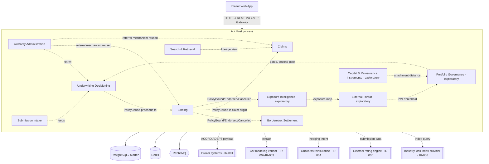
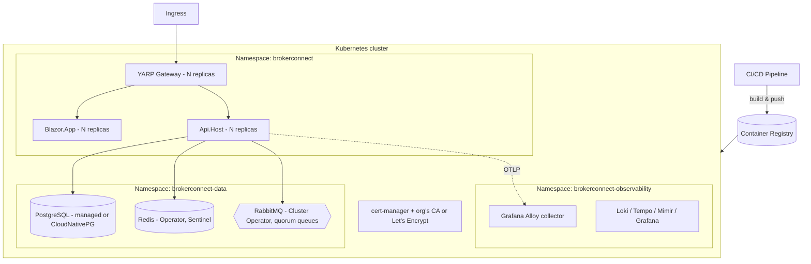

# Solution Architecture Document — Broker Connect (Pine Walk Underwriting Prototype)

## 1. Architectural Style

**Modular Monolith** using **Vertical Slice Architecture** inside each module, deployed as a small number of containers rather than a service per bounded context — while keeping module boundaries strict enough to extract a module into its own service later with minimal rework.

Core principles:
1. **One deployable, many modules.** `Api.Host` composes all 11 business modules (one per bounded context already modeled on the event-modelers board) into a single ASP.NET Core process.
2. **Vertical slices, not horizontal layers**, further constrained to exactly one of **state-change**, **state-view**, or **automation** (ADR-005) — this is not a general architecture preference, it's the same discipline the event model itself was built under all along (`STATE_CHANGE`/`STATE_VIEW`/`AUTOMATION` slice types on the board). The code structure is a direct continuation of the modeling discipline, not a separate decision.
3. **Module isolation at compile time.** Modules only reference each other's `Contracts` project (DTOs + integration events). Enforced via architecture fitness tests in CI (ADR-017).
4. **In-process calls within a module; async events across modules.** A slice in Binding never calls into Exposure Intelligence's domain directly — it publishes `PolicyBound` as an integration event, matching the 12 relationships already captured as `MODEL_CONTEXT` connection edges on the board (see Section 2). **Wolverine** is the single library for both paths (ADR-003).
5. **Marten event-sourcing, exclusively, for every module (ADR-002)** — this is the one architectural decision this project did not have to debate from scratch, because the domain modeling already answered it. See ADR-002's rationale.
6. **Command validation state is never a shared aggregate bundle (ADR-005).** Each command computes its own minimal state live from the events it actually needs — never a DDD-style aggregate reused by a second command handler.

## 2. Module Map & Boundaries



Dotted lines = async integration events via RabbitMQ (through the outbox), or external system integration. This is a direct rendering of the board's own context map (11 `MODEL_CONTEXT` nodes, 12 connection edges) into deployment/messaging terms — the architecture doesn't add relationships the modeling didn't already establish, it implements them.

### 2.1 Confirmed vs. exploratory modules

| Module | Board context | Scope status | Marten style |
|---|---|---|---|
| Authority Administration | 0 | Confirmed | Event-sourced |
| Submission Intake | 1a | Confirmed | Event-sourced |
| Search & Retrieval | 1b | Confirmed | Event-sourced (search activity log) + Marten projections for read models |
| Underwriting Decisioning | 2 | Confirmed | Event-sourced |
| Binding | 3 | Confirmed | Event-sourced |
| Bordereaux Settlement | 4 | Confirmed | Event-sourced |
| Claims | 5 | Confirmed | Event-sourced |
| Exposure Intelligence | 1c | Exploratory | Event-sourced |
| External Threat | 1d | Exploratory | Event-sourced |
| Portfolio Governance | 1e | Exploratory | Event-sourced |
| Capital & Reinsurance Instruments | 1f | Exploratory | Event-sourced |

**Every module is event-sourced (ADR-002) — there is no document-store branch to decide per module**, unlike a project that starts from an undecided position. This removes an entire category of per-module decision-making that a greenfield .NET project would normally have to make module by module.

### 2.2 Command State vs. Query Read Models (ADR-005)

Two different things must stay separate, same distinction the underlying `build-kit-dotnet-es` toolkit enforces at the code-generation level:

| | Command State | Query Read Model |
|---|---|---|
| Purpose | Validate one specific command's preconditions (e.g. does `AssessSubmission`'s proposed terms fit `AuthorityMatrix`) | Serve UI/processor queries (e.g. `SubmissionQueue`, `PolicyOriginationView`) |
| Shape | Minimal — only the fields that command's decision needs | Rich — whatever the screen needs, matches the board's `READMODEL` node fields exactly |
| Persistence | **Never persisted** — computed live via `AggregateStreamAsync<TState>` per invocation | Persisted Marten projection, kept current by a state-view slice's projector |
| Board equivalent | Not modeled as its own node — implicit in what a `COMMAND` needs to check | Every `READMODEL` node already on the board (24 of them) |

### 2.3 The Governance Engine as a Shared Building Block (ADR-006)

The event model surfaced a genuine cross-cutting capability, not three coincidentally similar features: the referral/escalation mechanism (`DecideReferral` → `ReferralApproved`/`ReferralDeclined`) is reused, by explicit design, across Underwriting Decisioning (`SubmissionReferred`), Binding (`EndorsementReferred`), and Claims (`ReserveRevisionReferred`) — see `Requirements/12-Non-Functional-Requirements.md` NFR-002.

**Decision: this becomes a shared library (`BuildingBlocks.Governance`), not a synchronous cross-module call and not three independent implementations.** Each module defines its own event types (`SubmissionReferred` vs. `EndorsementReferred` vs. `ReserveRevisionReferred`) — the events themselves stay module-owned, per ADR-004's isolation rule — but the *decision workflow* (compute breach against `AuthorityMatrix`, determine next tier, chain `parentReferralId` on repeat escalation, terminate at the cell's ceiling) is one generic, tested piece of code instantiated per module with that module's own event types as type parameters. This avoids two anti-patterns at once: reimplementing the same escalation logic three times with inevitable drift, and creating a hidden synchronous dependency between three modules that are supposed to be isolated.

## 3. Module Internal Structure (Vertical Slice)

Authoritative structure and rules live in `build-kit-dotnet-es/.claude/skills/{build-state-change,build-state-view,build-automation}/SKILL.md` — those skills are what actually generates each slice from the board. Summary shape, using Submission Intake as the example:

```
BrokerConnect.Modules.SubmissionIntake.Api/
├── Commands/
│   └── ReceiveBrokerSubmission/
│       ├── ReceiveBrokerSubmission.cs        (command record, fields match the board's COMMAND node)
│       └── ReceiveBrokerSubmissionHandler.cs ([WolverinePost] + validation + appends BrokerSubmissionReceived)
├── ReadModels/
│   └── SubmissionQueue/
│       ├── SubmissionQueueProjector.cs        (reacts to SubmissionNormalized, PotentialDuplicateSubmissionDetected, etc.)
│       └── GetSubmissionQueue.cs              ([WolverineGet])
├── Automations/
│   └── GenerateBaselinePremiumOnNormalization/
│       └── GenerateBaselinePremiumOnNormalizationHandler.cs  (triggered by SubmissionNormalized, calls IR-005's rating-engine client, appends BaselinePremiumGenerated)
├── IntegrationEvents/
│   ├── Consumers/       (e.g. ClaimNotified, consumed by Search & Retrieval's lineage automation)
│   └── Published/       (BrokerSubmissionReceived, SubmissionNormalized, etc. — the events other modules' context-map edges depend on)
├── Module.cs             (IModuleInstaller: DI registration, endpoint mapping)
└── SubmissionIntakeModuleDbConfig.cs

BrokerConnect.Modules.SubmissionIntake.Domain/
├── Aggregates/
│   └── Submission.cs    (self-aggregating event stream: BrokerSubmissionReceived, SubmissionNormalized, ...)
└── Events/
    └── (one file per EVENT node on the board for this context)

BrokerConnect.Modules.SubmissionIntake.Infrastructure/
└── RatingEngineClient.cs   (IR-005 anti-corruption-layer adapter — see Section 4.3)

BrokerConnect.Modules.SubmissionIntake.Contracts/
└── (public DTOs + integration events other modules may reference)
```

Each module exposes a single `Module.cs` implementing `IMartenModuleConfiguration`. `Api.Host`'s `Program.cs` discovers and wires these at startup.

## 4. Data Architecture

- **Single Postgres cluster, one Marten schema per module** — keeps module data physically isolated even inside one database, so a future split to separate databases is a config change, not a migration.
- **Event-sourced, all 11 modules (ADR-002)**: every domain entity is a self-aggregating event stream. Read models are Marten projections (async daemon), rebuilt from the stream — the same distinction the board already draws between `EVENT` nodes (write side, source of truth) and `READMODEL` nodes (query side, derived).
- **Outbox/inbox pattern via `WolverineFx.Marten`**: outgoing integration events are written in the same Postgres transaction as the domain change; incoming events are deduplicated by envelope ID. No hand-rolled outbox table.

### 4.1 Money and multi-currency (ADR-007)

Every settlement-relevant figure in this domain crosses currencies (`NFR-007`) — premium written in local currency, reported in USD, FX rate captured at transaction date, not at reporting time. **Decision: a shared `Money` value object (`BuildingBlocks.Domain.Money` — currency code + decimal amount) is used everywhere a monetary figure appears on an event, never a bare `decimal`.** FX-rate-at-transaction-date is captured as its own explicit field alongside `Money`, not derived later — matches how `BordereauSettled`/`SettleBordereau` already model `fxRate` explicitly on the board.

### 4.2 The event store as the primary audit trail (ADR-014)

This is a domain requirement, not an operational nicety. `NFR-001` (append-only, corrections are new entries), `NFR-003` (mandatory human confirmation for disputed determinations), and `NFR-004` (versioned governance records) are all directly satisfied by Marten's event stream being the actual system of record — nothing needs to be built to "add an audit trail," because the write model already is one. **This is worth stating explicitly to stakeholders**: a request for "can we see the full history of this decision" is answered by replaying the stream, not by a bolted-on logging table. Technical observability (Section 9) is a separate concern from this — traces/metrics answer "is the system healthy," the event store answers "what happened and why," and the two should not be conflated when someone asks for "audit logs."

### 4.3 External integrations as anti-corruption-layer adapters (ADR-008)

Each of the six integration boundaries in `Requirements/13-Integration-Requirements.md` gets a dedicated `Infrastructure`-project HTTP client in the module that owns the integration, never a shared "external services" grab-bag module:

| Integration | Owning module | Client |
|---|---|---|
| IR-001 ACORD/ADEPT broker exchange | Submission Intake | `BrokerAdeptClient` |
| IR-002 Cat-model extract | Exposure Intelligence | `CatModelExtractClient` |
| IR-003 PML recalculation | External Threat | `CatModelPmlClient` |
| IR-004 Reinsurance placement handoff | Portfolio Governance | `OutwardsReinsuranceHandoffClient` |
| IR-005 AI baseline pricing | Submission Intake | `RatingEngineClient` |
| IR-006 Industry loss index | Capital & Reinsurance Instruments | `IndustryLossIndexClient` |

All six use Polly resilience policies (retry with jittered backoff, circuit breaker) — every one of these was explicitly flagged during modeling as an external dependency with its own reliability profile (`ThreatFeedStale`, `IndustryLossIndexUpdated`'s same-pattern staleness concern). A feed going quiet is an expected failure mode this architecture must surface (matching `MonitorThreatFeedHealth`'s FR-ET-002), not one Polly should silently retry-and-hide forever — circuit-breaker state changes are logged and alertable.

## 5. Messaging Architecture (RabbitMQ)

- **Topic exchange** (`brokerconnect.events`) with routing keys matching event names (`policy.bound`, `claim.notified`, `authority.limit.revoked`). Wolverine's RabbitMQ transport maps this via convention, configured once in `Api.Host`.
- Each consuming module owns its own durable queue. A module's Wolverine handler for an integration event looks identical to a handler for a local automation trigger — no special "consumer" ceremony, matching how the board itself doesn't visually distinguish a same-module automation trigger from a cross-module one (both are just "an event this slice reacts to").
- **Dead-letter queues** per consumer queue, with alerting on DLQ depth — the same discipline `ThreatFeedStale`/`MonitorThreatFeedHealth` established for external feeds applies internally too: a silently-stuck consumer is the same class of problem as a silently-stale external feed.
- Message contracts versioned (`PolicyBoundV1`), living in each module's `Contracts` project.

## 6. Caching Architecture (Redis)

Lighter than a consumer-facing app — this is an internal underwriting workbench, not a high-traffic public product:

| Use case | Pattern |
|---|---|
| `AuthorityMatrix` lookups (hot path — checked on every `AssessSubmission`) | Cache-aside, short TTL, invalidated on `AuthorityLimitRevised`/`Revoked` |
| `ActiveFreezeRegister` lookups (checked on every quote issuance, per FR-PG-002) | Cache-aside, invalidated on `TerritoryUnderwritingFrozen`/`Lifted`/`Overridden` |
| Session/auth token cache | `IDistributedCache` for token introspection |

Both cached lookups sit directly on the two governance gates into Underwriting Decisioning (Context 0 and Context 1e) — these are exactly the two checks `SubmissionWithinAuthority`'s `authorityVersionChecked`/`freezeCheckPassed` fields were added to make provably run (NFR-003/FR-UD-002); caching them is a performance concern layered on top of that correctness requirement, not a replacement for it — cache invalidation on the relevant revision/revocation/freeze event is not optional.

## 7. Deployment Architecture

**Decision: Kubernetes from the start (ADR-011), not a single-box MVP shortcut.** This is a deliberate departure from a consumer-MVP pattern of "cheapest thing that works, scale later." An underwriting platform handling real premium and claims money for a regulated (re)insurance business has HA and auditability requirements that aren't optional at MVP stage the way they might be for a dating app — a single point of failure taking down bordereaux settlement or claims payment mid-period is a different order of business risk than a dating app's chat feature going down for an hour.



- **Managed Postgres preferred over self-hosted (org-dependent, ADR-013)**: given this handles real financial transactions, prefer a managed Postgres service with the org's existing backup/PITR/compliance posture over operating CloudNativePG in-cluster, if the organization already has one available (this decision explicitly deferred to whichever cloud/on-prem platform TFP already standardizes on — see DEC-031).
- **Three deployables**: `Gateway` (YARP), `Api.Host` (all 11 modules), `Blazor.App` — same shape as the reference pattern this toolkit was proven against.

## 8. Security Architecture

- **AuthN**: JWT bearer tokens. **Identity provider is an open decision (ADR-010, DEC-032)** — this platform has a materially different identity shape than a consumer app: internal TFP/Pine Walk staff (underwriters, governance, ops, actuarial) *and* external parties (brokers, capacity providers/TPAs) both need authenticated access, with different trust levels. Whether that's one enterprise IdP with external guest accounts, or a B2B2C-style split (internal SSO + separate broker portal identity), depends on TFP's existing infrastructure — flagged for their input, not decided here.
- **AuthZ**: Policy-based per endpoint, mapped directly from the **Role Catalog** already on the board (14 `ACTOR` nodes — `Requirements/00-Overview.md` Actors table). Ten human-role policies, four system-actor service-to-service credentials (rating engine, weather feed, industry loss index, ingestion service) using scoped API keys or mTLS, not user-shaped tokens.
- **Cell-scoped vs. cross-cell authorization (NFR-006)** is enforced at the handler level, matching `CrossCellSearchAttempted`'s explicit modeling — this is a first-class authorization rule already fully specified by the event model, not something to design fresh in code.
- **Transport**: TLS everywhere.
- **Secrets**: deferred to the organization's existing secrets management (Vault, cloud KMS, or equivalent) rather than this project introducing its own — an enterprise underwriting platform should not be the first place secrets policy gets decided (DEC-033).
- **Data privacy**: submission/claim data includes named insureds and loss details — classify and handle per whatever data-protection regime applies to TFP's operating territories (Bermuda, LatAm, APAC per the domain notes in `bordereaux.md`); this needs compliance input, not an architectural default (DEC-034).

## 9. Observability (ADR-012)

Zero-code OpenTelemetry auto-instrumentation, OTLP → Grafana Alloy → Loki/Tempo/Mimir/Grafana — same proven pattern as the reference architecture this toolkit assumes, reused rather than redesigned. **Important distinction restated from Section 4.2**: this stack answers operational questions (latency, error rates, trace-through of a request across the async boundary via Wolverine's W3C trace-context propagation). It is not the audit trail — that's the event store itself. A dashboard alert on RabbitMQ DLQ depth or `ThreatFeedStale`-style external-feed silence is exactly what this stack is for; "show me every decision where `freezeCheckPassed` was false" (DEC-030) is an event-store/read-model query, not a Grafana panel.

## 10. Key Architecture Decisions (ADR summary — full ADRs in `docs/adr/`)

| ADR | Decision | Status |
|---|---|---|
| ADR-001 | Modular monolith over microservices for MVP, 11 modules matching the 11 board contexts | **Decided** |
| ADR-002 | Marten event-sourcing exclusively, every module — no per-module document/event-sourced decision, because the domain's own immutable-ledger principle (NFR-001) already answers it | **Decided** |
| ADR-003 | Wolverine as the single mediator/messaging library (in-process + RabbitMQ via `WolverineFx.Marten` outbox/inbox) | **Decided** |
| ADR-004 | Module boundaries = the board's 11 `MODEL_CONTEXT` nodes exactly; cross-module references only via `Contracts` projects | **Decided** |
| ADR-005 | Command validation state computed live per invocation, never a shared persisted aggregate; distinct from persisted read-model projections | **Decided** |
| ADR-006 | Shared `BuildingBlocks.Governance` library for the referral/escalation pattern reused across Underwriting Decisioning, Binding, and Claims (NFR-002) — generic workflow, module-owned event types | **Decided** |
| ADR-007 | Shared `Money` value object (currency + amount) plus explicit FX-rate-at-transaction-date field on every settlement-relevant event, never a bare `decimal` | **Decided** |
| ADR-008 | Six external integrations (IR-001–IR-006) as dedicated anti-corruption-layer HTTP clients in their owning module, with Polly retry/circuit-breaker resilience | **Decided** |
| ADR-009 | Frontend: Blazor Server (rich interactive workbench UI across 10 human-role screens already designed; no offline/WASM requirement for an internal enterprise tool) | Proposed |
| ADR-010 | Identity provider: mixed internal-staff + external-broker/provider access shape — depends on TFP's existing infrastructure | To be decided (DEC-032) |
| ADR-011 | Deployment: Kubernetes from day one, not a single-box MVP shortcut — HA/audit requirements for a regulated underwriting platform aren't deferrable the way a consumer MVP's are | **Decided** |
| ADR-012 | Observability: Grafana LGTM + Alloy, zero-code OpenTelemetry — explicitly distinct from the event-store-as-audit-trail (ADR-014) | **Decided** |
| ADR-013 | Database: single Postgres cluster, schema-per-module; managed Postgres preferred over self-hosted if TFP has one available | Proposed, hosting TBD (DEC-031) |
| ADR-014 | The Marten event stream is the primary audit trail for governance/compliance questions; technical observability (ADR-012) is a separate concern | **Decided** |
| ADR-015 | Exploratory contexts (1c/1d/1e/1f) built behind feature flags / a later delivery phase, not the initial release — see Project Plan phasing | **Decided** |
| ADR-016 | Gateway: YARP (.NET-native reverse proxy) in front of `Api.Host` + `Blazor.App` | **Decided** |
| ADR-017 | CI enforces architecture fitness tests: no illegal cross-module references (ADR-004), no command handler loading a shared persisted snapshot (ADR-005) | **Decided** |
| ADR-018 | Secrets management deferred to the organization's existing platform, not decided by this project | To be decided (DEC-033) |

Full ADR text (context, alternatives considered, consequences) lives in `docs/adr/` once the solution is scaffolded — this table is the authoritative summary until then, same convention as the reference architecture this toolkit was validated against.
