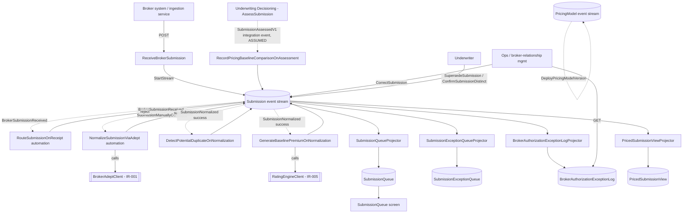
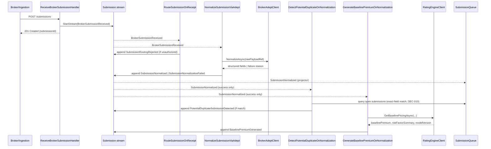

# Design: Submission Intake

## Overview

Broker submissions land via `ReceiveBrokerSubmission` (always succeeds), then two independent automations fan out from `BrokerSubmissionReceived`: an authorization-routing check (→ `SubmissionRoutingRejected` on failure) and async ADEPT normalization via `BrokerAdeptClient` (IR-001, → `SubmissionNormalized`/`SubmissionNormalizationFailed`). Successful normalization triggers duplicate detection (exact-field, DEC-010) and AI baseline pricing via `RatingEngineClient` (IR-005, IR-005). One self-aggregating `Submission` stream carries the full lifecycle; four dedicated read-model projectors serve the underwriter queue, ops exception queues, and the priced-submission audit view.

## Architecture



Dotted lines = event-triggered (Wolverine subscriber), not direct calls. `Submission` is one aggregate/stream per `submissionId`; `PricingModel` is a separate, unrelated stream (audit-only reference data).

### Sequence: Receipt → Normalization → Duplicate + Pricing



## Board-Sourced vs. Inferred Elements

Per constitution Principle III, every field below traces to `requirements.md`'s Event Model Detail appendix. Names not literally present on the board are marked **(inferred)** — the board's `FACT_ONLY`-inferred slices and unlabeled processor gaps require *something* to append these events; a name had to be chosen, but no field/behavior beyond what the board states was invented.

| Element | Board-named? | Notes |
|---|---|---|
| `ReceiveBrokerSubmission` | Yes (COMMAND node) | |
| `GenerateBaselinePremiumOnNormalization` | Yes (AUTOMATION node) | |
| `RouteSubmissionOnReceipt` | **Inferred** | `SubmissionRoutingRejected`'s slice has no processor node — something must decide routing |
| `NormalizeSubmissionViaAdept` | **Inferred** | `SubmissionNormalized`/`SubmissionNormalizationFailed` slices are typed `STATE_VIEW`, not `AUTOMATION`, but no command produces them either — DEC-006 confirms they're async, so an automation is the only fit |
| `DetectPotentialDuplicateOnNormalization` | **Inferred** | `PotentialDuplicateSubmissionDetected` is `FACT_ONLY`-inferred, no processor |
| `CorrectSubmission` | **Inferred** | `SubmissionManuallyCorrected` is `FACT_ONLY`-inferred, no command |
| `SupersedeSubmission` | **Inferred** | `SubmissionSuperseded` is `FACT_ONLY`-inferred, no command |
| `ConfirmSubmissionDistinct` | **Inferred** | `SubmissionConfirmedDistinct` is `FACT_ONLY`-inferred, no command |
| `DeployPricingModelVersion` | **Inferred** | `PricingModelVersionDeployed` is `FACT_ONLY`-inferred, no command |
| `RecordPricingBaselineComparisonOnAssessment` | **Inferred** | `PricingBaselineAccepted`/`Overridden` fire "alongside AssessSubmission" — a Underwriting Decisioning (context 2) command this module doesn't own; modeled as cross-module integration-event consumption (see Unresolved Questions) |

## Components

### `Submission` aggregate (Domain)

Self-aggregating stream, one per `submissionId`, created by `BrokerSubmissionReceived`. Every other event in this context except `PricingModelVersionDeployed` applies to this same stream.

**Apply-computed state** (only what handlers/automations actually need to decide something — not a UI-facing shape):

| Field | Type | Source |
|---|---|---|
| `SubmissionId` | `Guid` | `BrokerSubmissionReceived` |
| `BrokerFirmId` | `string` | `BrokerSubmissionReceived` |
| `RawPayloadRef` | `string` (Custom) | `BrokerSubmissionReceived` |
| `NormalizationStatus` | `string?` | `SubmissionNormalized`/`SubmissionNormalizationFailed` |
| `ClassOfBusiness`, `Territory`, `NamedInsured`, `LineSizeSought`, `KeyTerms`, `EffectiveDateRequested` | mixed | `SubmissionNormalized` |
| `IsRoutingRejected` | `bool` | `SubmissionRoutingRejected` |
| `IsPossibleDuplicate`, `SuspectedOriginalSubmissionId` | `bool`, `Guid?` | `PotentialDuplicateSubmissionDetected` |
| `SupersededBySubmissionId` / `IsConfirmedDistinct` | `Guid?`, `bool` | `SubmissionSuperseded` / `SubmissionConfirmedDistinct` |
| `BaselinePremium`, `RiskFactorSummary`, `ModelVersion` | `decimal?`, Custom, `string?` | `BaselinePremiumGenerated` |

`[JsonInclude]`/`[JsonConstructor]` required (Principle I). No `Inline` snapshot registered — nothing under `ReadModels/**` queries `Submission` by id directly; every read model is its own dedicated projected document (Architecture Constraints: snapshots opt-in). Command/automation handlers reach it via `FetchForWriting<Submission>`/`AggregateStreamAsync<Submission>` per invocation.

### `PricingModel` aggregate (Domain)

Separate, unrelated single-event stream keyed by a generated id (or `modelVersion`, TBD at implementation — board gives no id field name beyond `modelVersion`, which is not marked `id`). Audit-only reference data; no read model consumes it per the board's own dependency edges.

### Commands (state-change)

| Command | Route (proposed) | Appends | Notes |
|---|---|---|---|
| `ReceiveBrokerSubmission` | `POST /api/v1/submission-intake/submissions` | `BrokerSubmissionReceived` (`StartStream`) | Always succeeds if payload arrives (AC-1.1) — no validation beyond `[Required]` field presence |
| `CorrectSubmission` | `POST /api/v1/submission-intake/submissions/{submissionId}/corrections` | `SubmissionManuallyCorrected` | Ops/broker remediation; does **not** itself re-normalize — `resubmittedForNormalization` flag is read by `NormalizeSubmissionViaAdept` (automation), per Principle II (no downstream consequence inlined) |
| `SupersedeSubmission` | `POST /api/v1/submission-intake/submissions/{originalSubmissionId}/supersede` | `SubmissionSuperseded` (on **original**'s stream) | Underwriter/ops resolution of a flagged duplicate |
| `ConfirmSubmissionDistinct` | `POST /api/v1/submission-intake/submissions/{submissionId}/confirm-distinct` | `SubmissionConfirmedDistinct` (on the **flagged/new**'s stream) | Underwriter/ops resolution |
| `DeployPricingModelVersion` | `POST /api/v1/submission-intake/pricing-models` | `PricingModelVersionDeployed` (`StartStream<PricingModel>`) | Actuarial/admin; audit reference only |

### Automations

| Automation | Trigger | Decides | Appends / Calls |
|---|---|---|---|
| `RouteSubmissionOnReceipt` | `BrokerSubmissionReceived` | Broker panel authorization for `cellIdHint`/`classOfBusinessHint` (DEC-009: hard block) — **data source unresolved, see Unresolved Questions** | `SubmissionRoutingRejected` if rejected; no-op if authorized |
| `NormalizeSubmissionViaAdept` | `BrokerSubmissionReceived`, `SubmissionManuallyCorrected` (guard: `resubmittedForNormalization == true`) | Calls `BrokerAdeptClient` (IR-001) to extract structured fields from `rawPayloadRef` | `SubmissionNormalized` or `SubmissionNormalizationFailed` |
| `DetectPotentialDuplicateOnNormalization` | `SubmissionNormalized` (success only) | Exact-field match: `classOfBusiness` + `territory` + `namedInsured` against other non-superseded, non-confirmed-distinct open submissions (DEC-010) | `PotentialDuplicateSubmissionDetected` if match found |
| `GenerateBaselinePremiumOnNormalization` | `SubmissionNormalized` (success only, S1a.5) | Calls `RatingEngineClient` (IR-005) with normalized fields | `BaselinePremiumGenerated` |
| `RecordPricingBaselineComparisonOnAssessment` | Cross-module integration event from Underwriting Decisioning (**assumed** `SubmissionAssessedV1`, unconfirmed — see Unresolved Questions) | Compares `proposedPremium` to `BaselinePremiumGenerated.baselinePremium`, computed live via `AggregateStreamAsync<SubmissionPricingState>` (never persisted, per Architecture Constraints) | `PricingBaselineAccepted` (exact match) or `PricingBaselineOverridden` (variance computed) |

All automations are idempotent per Architecture Constraints: `NormalizeSubmissionViaAdept`/`GenerateBaselinePremiumOnNormalization`/`DetectPotentialDuplicateOnNormalization` check `Submission.NormalizationStatus`/`BaselinePremium`/`IsPossibleDuplicate` (already-set) before acting; `RecordPricingBaselineComparisonOnAssessment` checks whether a `PricingBaseline{Accepted,Overridden}` already exists for the assessment.

### Read Models (state-view)

| Read Model | Kind | Fed by (board) | Fed by (design — gap-fixed, see Technical Decisions) |
|---|---|---|---|
| `BrokerAuthorizationExceptionLog` | Projector (`MultiStreamProjection` or Wolverine-subscriber, keyed by `submissionId`) | `SubmissionRoutingRejected` | — |
| `SubmissionQueue` | Projector, keyed by `submissionId` | `SubmissionNormalized`, `SubmissionRoutingRejected` | **+ `PotentialDuplicateSubmissionDetected`, `SubmissionSuperseded`, `SubmissionConfirmedDistinct`** |
| `SubmissionExceptionQueue` | Projector, keyed by `submissionId` | `SubmissionNormalizationFailed` | **+ `SubmissionManuallyCorrected`** |
| `PricedSubmissionView` | Projector, keyed by `submissionId` | `BaselinePremiumGenerated`, `SubmissionConfirmedDistinct` | **+ `SubmissionNormalized`** (for `brokerRequestedTerms`) |

## Screens

### `SubmissionQueue` (underwriter's worklist, from `research.md` UI Reference)

Board transcription: violet header `Submission Queue - itasca-mga`, search box top-right, columns **Insured / Class / Line Size / Received / Status**, rows with a green "Ready" or orange "Possible Dup" badge, footer "N submissions - M flagged as possible duplicate".

| Screen element | Read-model field | Gap? |
|---|---|---|
| Header "itasca-mga" | `brokerFirmId` (query filter/display value) | Query endpoint scopes/filters by `brokerFirmId` |
| Search box | new query param `search` (matches `namedInsured`/`brokerFirmId`, case-insensitive) | Not board-specified; minimal, flagged as inferred |
| **Insured** column | **`namedInsured`** | **Gap** — `SubmissionQueue`'s board field list has no `namedInsured`, but the screen requires it and the projector already subscribes to `SubmissionNormalized` (which carries it). Added to the read model and response DTO — see Technical Decisions. |
| Class column | `classOfBusiness` | None |
| Line Size column | `lineSizeSought` (formatted `$X.XM` client-side) | None |
| Received column | `receivedAt` | None |
| Status badge (green "Ready") | `status` (set from `SubmissionNormalized.normalizationStatus` at projection time) | None |
| "Possible Dup" badge (orange) | `isPossibleDuplicate` | Sourced via the gap-fix above (board doesn't wire `PotentialDuplicateSubmissionDetected` to this read model at all — see Technical Decisions) |
| Footer summary | Derived: `totalCount`, `possibleDuplicateCount` — computed by the query handler over the returned page, not stored fields | Not board-specified |

Proposed `GetSubmissionQueue` response DTO:

```csharp
public sealed record SubmissionQueueResponse(
    IReadOnlyList<SubmissionQueueItem> Items,
    int Page, int PageSize, int TotalCount, int PossibleDuplicateCount);

public sealed record SubmissionQueueItem(
    Guid SubmissionId, string BrokerFirmId, string NamedInsured, string ClassOfBusiness,
    string Territory, decimal LineSizeSought, DateTimeOffset ReceivedAt, string Status,
    bool IsPossibleDuplicate, Guid? SuspectedOriginalSubmissionId);
```

## Technical Decisions

| Decision | Options Considered | Choice | Rationale |
|---|---|---|---|
| `SubmissionQueue` fed by `PotentialDuplicateSubmissionDetected`, `SubmissionSuperseded`, `SubmissionConfirmedDistinct` | (a) implement literally per board (only `SubmissionNormalized`/`SubmissionRoutingRejected`), leaving `isPossibleDuplicate` permanently `false`; (b) add the missing subscriptions | (b) | Principle III: a declared field (`isPossibleDuplicate`, `suspectedOriginalSubmissionId`) with **no event source at all** is a genuine defect, not an intentional board scope limit (unlike a consistently-absent edge) — same precedent as 001's `AuthorityMatrix` fix |
| `SubmissionQueue` adds `namedInsured` | (a) omit, screen can't render "Insured" column; (b) add it, sourced from an event the projector already subscribes to | (b) | Directly requested: screen is a concrete DTO driver, not decoration. `SubmissionNormalized` already carries the field and is already a subscribed trigger — zero new dependency edges, only a wider projection |
| `SubmissionExceptionQueue` fed by `SubmissionManuallyCorrected` | (a) literal board scope (status field never changes); (b) add subscription | (b) | Same Principle III reasoning — `status` field otherwise has no event that can ever move it off its initial value |
| `PricedSubmissionView` fed by `SubmissionNormalized` | (a) leave `brokerRequestedTerms` with no source; (b) populate from normalized fields | (b) | `brokerRequestedTerms` (Custom) has zero listed event dependency anywhere on the board — the only fields plausibly matching "the broker's ask" are `SubmissionNormalized`'s structured fields |
| Raw payload storage | (a) inline the full ACORD/ADEPT payload in the event; (b) store it externally, event carries a reference | (b) | Field naming shift `rawPayload` (command) → `rawPayloadRef` (event) signals a reference, not inline content — keeps event rows small; actual storage mechanism (blob store) is an implementation detail, not specified by the board |
| Routing check vs. normalization: parallel or sequential | (a) sequential (route after normalize); (b) parallel, both triggered directly by `BrokerSubmissionReceived` | (b) | `SubmissionRoutingRejected`'s fields (`requestedCellId`, `requestedClassOfBusiness`) mirror `ReceiveBrokerSubmission`'s **hint** fields, not `SubmissionNormalized`'s structured fields — routing decides off what's available at receipt, independent of normalization's success/failure |
| `AssessSubmission`'s pricing-comparison events | (a) treat as out of scope (owned by Underwriting Decisioning); (b) model as this module's automation reacting to a cross-module integration event | (b) | The events (`PricingBaselineAccepted`/`Overridden`) are explicitly modeled with `aggregate: Submission`, `modelContext: Submission Intake` — they belong to this module's stream even though the triggering command (`AssessSubmission`) does not. ADR-004 forbids a direct cross-module call, so consumption via integration event is the only compliant shape |
| Duplicate-match heuristic | (a) fuzzy/probabilistic; (b) exact-field (DEC-010) | (b) | Resolved by user interview (DEC-010) — exact match on `classOfBusiness` + `territory` + `namedInsured`, the fields actually available per `SubmissionNormalized` |
| Broker notification on normalization failure | (a) automated; (b) manual chase only | (b) | DEC-007, resolved |
| Retry/abandonment timeout on exception queue | (a) timeout policy; (b) none | (b) | DEC-008, resolved — entries persist indefinitely until `SubmissionManuallyCorrected` |
| Broker-authorization rejection feedback | (a) broker notified; (b) hard block, ops-only | (b) | DEC-009, resolved |
| `Submission` Inline snapshot | (a) register one; (b) none | (b) | No read model queries `Submission` by id directly — every read model is its own dedicated document. Architecture Constraints: snapshots are opt-in, added only when genuinely needed |

## File Structure

```
src/Modules/SubmissionIntake/
├── BrokerConnect.Modules.SubmissionIntake.Api/
│   ├── Commands/
│   │   ├── ReceiveBrokerSubmission/
│   │   │   ├── ReceiveBrokerSubmission.cs
│   │   │   └── ReceiveBrokerSubmissionHandler.cs
│   │   ├── CorrectSubmission/
│   │   │   ├── CorrectSubmission.cs
│   │   │   └── CorrectSubmissionHandler.cs
│   │   ├── SupersedeSubmission/
│   │   │   ├── SupersedeSubmission.cs
│   │   │   └── SupersedeSubmissionHandler.cs
│   │   ├── ConfirmSubmissionDistinct/
│   │   │   ├── ConfirmSubmissionDistinct.cs
│   │   │   └── ConfirmSubmissionDistinctHandler.cs
│   │   └── DeployPricingModelVersion/
│   │       ├── DeployPricingModelVersion.cs
│   │       └── DeployPricingModelVersionHandler.cs
│   ├── Automations/
│   │   ├── RouteSubmissionOnReceipt/
│   │   │   └── RouteSubmissionOnReceiptHandler.cs
│   │   ├── NormalizeSubmissionViaAdept/
│   │   │   └── NormalizeSubmissionViaAdeptHandler.cs
│   │   ├── DetectPotentialDuplicateOnNormalization/
│   │   │   └── DetectPotentialDuplicateOnNormalizationHandler.cs
│   │   ├── GenerateBaselinePremiumOnNormalization/
│   │   │   └── GenerateBaselinePremiumOnNormalizationHandler.cs
│   │   └── RecordPricingBaselineComparisonOnAssessment/
│   │       ├── SubmissionPricingState.cs        (live-computed decision state, never persisted)
│   │       └── RecordPricingBaselineComparisonOnAssessmentHandler.cs
│   ├── ReadModels/
│   │   ├── SubmissionQueue/
│   │   │   ├── SubmissionQueue.cs
│   │   │   ├── SubmissionQueueProjector.cs      (class *Handler per event, Wolverine-subscriber pattern)
│   │   │   └── GetSubmissionQueue.cs
│   │   ├── SubmissionExceptionQueue/
│   │   │   ├── SubmissionExceptionQueue.cs
│   │   │   ├── SubmissionExceptionQueueProjector.cs
│   │   │   └── GetSubmissionExceptionQueue.cs
│   │   ├── BrokerAuthorizationExceptionLog/
│   │   │   ├── BrokerAuthorizationExceptionLog.cs
│   │   │   ├── BrokerAuthorizationExceptionLogProjector.cs
│   │   │   └── GetBrokerAuthorizationExceptionLog.cs
│   │   └── PricedSubmissionView/
│   │       ├── PricedSubmissionView.cs
│   │       ├── PricedSubmissionViewProjector.cs
│   │       └── GetPricedSubmissionView.cs
│   ├── IntegrationEvents/
│   │   ├── Consumers/
│   │   │   └── SubmissionAssessedV1.cs          (assumed contract from Underwriting Decisioning — see Unresolved Questions)
│   │   └── Published/                            (none identified — no other module's dependency edge into Submission Intake's events per the board)
│   ├── Module.cs                                 (IMartenModuleConfiguration, SchemaName = "submissionintake")
│   └── SubmissionIntakeModuleDbConfig.cs
├── BrokerConnect.Modules.SubmissionIntake.Domain/
│   ├── Aggregates/
│   │   ├── Submission.cs
│   │   └── PricingModel.cs
│   └── Events/
│       └── SubmissionIntakeEvents.cs             (one record per board event — 12 total)
├── BrokerConnect.Modules.SubmissionIntake.Infrastructure/
│   ├── BrokerAdeptClient.cs                      (IR-001, Polly retry+circuit breaker)
│   └── RatingEngineClient.cs                     (IR-005, Polly retry+circuit breaker)
└── BrokerConnect.Modules.SubmissionIntake.Contracts/
    └── (no outbound integration events identified for this module — flag if a later module's plan needs one)

tests/Modules/SubmissionIntake/
├── SubmissionIntake.Domain.Tests/               (Layer 1)
├── SubmissionIntake.Api.Tests/                  (Layer 2)
└── SubmissionIntake.IntegrationTests/           (Layer 3, Testcontainers)
```

## Interfaces

```csharp
// Infrastructure/BrokerAdeptClient.cs (IR-001)
public interface IBrokerAdeptClient
{
    Task<AdeptNormalizationResult> NormalizeAsync(string rawPayloadRef, CancellationToken cancellationToken);
}
public sealed record AdeptNormalizationResult(
    bool Succeeded, string? ClassOfBusiness, string? Territory, decimal? LineSizeSought,
    string? KeyTerms, string? NamedInsured, DateOnly? EffectiveDateRequested,
    string? FailureReason);

// Infrastructure/RatingEngineClient.cs (IR-005)
public interface IRatingEngineClient
{
    Task<BaselinePricingResult> GetBaselinePricingAsync(
        Guid submissionId, string classOfBusiness, string territory, decimal lineSizeSought,
        CancellationToken cancellationToken);
}
public sealed record BaselinePricingResult(decimal BaselinePremium, object RiskFactorSummary, string ModelVersion);

// Commands/ReceiveBrokerSubmission/ReceiveBrokerSubmission.cs
public sealed record ReceiveBrokerSubmissionRequest(
    [property: Required, MaxLength(200)] string BrokerFirmId,
    [property: Required, MaxLength(200)] string SubmittingContact,
    string? CellIdHint,
    string? ClassOfBusinessHint,
    [property: Required] object RawPayload,
    [property: Required, MaxLength(50)] string SourceChannel);
public sealed record ReceiveBrokerSubmissionResponse(Guid SubmissionId, DateTimeOffset ReceivedAt);

// ReadModels/SubmissionQueue/GetSubmissionQueue.cs
[WolverineGet("/api/v1/submission-intake/submission-queue")]
// filters: brokerFirmId?, classOfBusiness?, search?, page, pageSize
```

## Error Handling

| Error Scenario | Handling Strategy | User Impact |
|---|---|---|
| ADEPT normalization fails (missing field, malformed data, unrecognized class code) | `NormalizeSubmissionViaAdept` appends `SubmissionNormalizationFailed`; raw payload preserved (never discarded, per AC-4.1) | Ops sees it in `SubmissionExceptionQueue`; no underwriter/broker visibility (DEC-007) |
| Broker panel authorization rejects the submission | `RouteSubmissionOnReceipt` appends `SubmissionRoutingRejected` | Ops/broker-relationship-management sees it in `BrokerAuthorizationExceptionLog`; hard block, no broker feedback (DEC-009) |
| `BrokerAdeptClient`/`RatingEngineClient` unavailable (IR-001/IR-005 outage) | Polly circuit breaker (ADR-008); breaker-open state logged/alertable, not silently retried forever | For IR-001: automation retries per Polly policy, then the submission simply has no `SubmissionNormalized`/`Failed` event yet — a stuck-pending state distinct from an explicit failure; flagged as an operational gap in Edge Cases below, since the board only models the two terminal outcomes, not "still trying" |
| Concurrency conflict on `Submission` stream (e.g. two automations racing) | Central `409` mapping in `Program.cs` (both `JasperFx.ConcurrencyException`/`Marten.Exceptions.ConcurrentUpdateException`), per Architecture Constraints | N/A — internal automations retry via Wolverine's normal redelivery, not user-facing |
| Redelivered trigger event (at-least-once) | Every automation checks target state before acting (idempotency guard, Architecture Constraints) | None — no duplicate effect |
| `RecordPricingBaselineComparisonOnAssessment` fires before `BaselinePremiumGenerated` exists | Guard: no-op / defer (log and skip) rather than fail — should not happen in practice since `AssessSubmission` is a later workflow step, but not provably ordered from this module's view | Underwriter assessment proceeds; pricing-baseline comparison silently not recorded — flagged as an edge case, not a hard failure |

## Edge Cases

- **Submission stuck in normalization** (IR-001 outage exhausts Polly retries): no board-modeled terminal state for this — neither `SubmissionNormalized` nor `SubmissionNormalizationFailed` fires. Flagged, not resolved: implementation should decide whether exhausted retries produce `SubmissionNormalizationFailed` with a synthetic `failureReason` (e.g., `"AdeptServiceUnavailable"`) — reasonable, but confirm with user before treating an infra failure as a business failure event.
- **Duplicate detected against a submission that itself later gets superseded/confirmed-distinct**: `DetectPotentialDuplicateOnNormalization` only excludes already-resolved *targets* at match time; a race where both directions flag each other concurrently is possible if two similar submissions arrive close together — resolution commands (`SupersedeSubmission`/`ConfirmSubmissionDistinct`) are idempotent no-ops if the flag is already cleared.
- **`SubmissionRoutingRejected` after normalization already succeeded** (routing and normalization run in parallel, per the parallel-not-sequential decision): both events land on the same stream regardless of order; `SubmissionQueueProjector`'s handling of `SubmissionRoutingRejected` removes/suppresses any queue entry (delete-if-exists), so a late rejection retracts an already-visible queue row. This reconciles the board's literal dependency edge (`SubmissionRoutingRejected → SubmissionQueue`) with the narrative ("never appears in any underwriter's queue").
- **`CorrectSubmission` with `resubmittedForNormalization = false`**: `NormalizeSubmissionViaAdept` is not re-triggered; the exception-queue entry's `status` still updates to reflect the correction (per the gap-fix above), but the submission stays terminal from a normalization standpoint until a subsequent correction opts back in.
- **Broker firm has no panel authorization data at all** (new broker, no prior relationship): unresolved — see Unresolved Questions on `RouteSubmissionOnReceipt`'s data source.

## Dependencies

- **IR-001** ACORD/ADEPT broker exchange — `BrokerAdeptClient`, owned here (Solution Arch §4.3).
- **IR-005** AI baseline pricing — `RatingEngineClient`, owned here (Solution Arch §4.3).
- **Authority Administration** (context 0) — likely owner of broker-panel-authorization data `RouteSubmissionOnReceipt` needs; not confirmed by any board dependency edge (Unresolved Questions).
- **Underwriting Decisioning** (context 2, not yet built) — publishes the assumed `SubmissionAssessedV1` integration event this module's `RecordPricingBaselineComparisonOnAssessment` consumes; flag in that module's own plan (mirrors how 001 flagged `AuthorityLimitChangedV1` for 004's consumption).

## Security Considerations

- `ReceiveBrokerSubmission` is a system/service-to-service endpoint (broker system or Broker Connect's own ingestion service, per the board narrative — "not necessarily a direct user action"), authenticated via scoped API key/mTLS per Solution Arch §8 (four system-actor credentials), not a user-shaped token.
- `CorrectSubmission`, `SupersedeSubmission`, `ConfirmSubmissionDistinct`, `DeployPricingModelVersion` are human-role actions (ops/underwriter/actuarial) — role-gated `[Authorize]` policy per Solution Arch §8's Role Catalog; specific policy names deferred pending ADR-010 (identity provider), same TODO pattern as 001's `GrantCellAuthorityLimitHandler`.
- `namedInsured`, `submittingContact` are PII-shaped fields (constitution Quality Gates) — flagged for an explicit masking/retention decision at implementation time, not assumed safe by default.
- Raw payload (ACORD/ADEPT blob) may contain sensitive risk/insured detail — wherever it's stored (Technical Decisions: reference, not inline), that store needs the same data-protection posture as the rest of submission data.

## Performance Considerations

- No numeric NFR target stated by the board (requirements.md NFR-1/2/3 are explicitly N/A) — none invented here.
- `SubmissionQueue`/`SubmissionExceptionQueue`/`BrokerAuthorizationExceptionLog` list endpoints are paginated from v1 (constitution Principle VII), consistent with 001's `GetCellAuthorityRegister` pattern (page/pageSize with a capped max).
- `DetectPotentialDuplicateOnNormalization`'s exact-field match queries `SubmissionQueue` in-memory after an indexed Marten filter on `classOfBusiness`/`territory` — index both fields (`options.Schema.For<SubmissionQueue>().Index(...)`) since every successful normalization triggers this lookup.

## Test Strategy (constitution Principle IV, three layers)

### Layer 1 — Domain (xUnit + Shouldly, no mocks)
- `Submission.Create`/each `Apply` method — one test per event type, asserting resulting state shape.
- `PricingModel.Create`.
- Idempotency-relevant state checks (`NormalizationStatus` already set, `BaselinePremium` already set, etc.) as pure state assertions.

### Layer 2 — Handler (xUnit + Shouldly + NSubstitute)
- `ReceiveBrokerSubmissionHandler`: always-succeeds path (AC-1.1).
- `CorrectSubmissionHandler`, `SupersedeSubmissionHandler`, `ConfirmSubmissionDistinctHandler`, `DeployPricingModelVersionHandler`: straightforward append-and-respond shapes, mockable per `build-state-change` guidance.
- Query handlers (`GetSubmissionQueue`, etc.): filter/pagination logic, in-memory list.

### Layer 3 — Testcontainers (real Postgres-backed Marten)
- All four projectors — one test per event they subscribe to, including the gap-fixed subscriptions (`SubmissionQueueProjector` reacting to `PotentialDuplicateSubmissionDetected`/`SubmissionSuperseded`/`SubmissionConfirmedDistinct`; `SubmissionExceptionQueueProjector` reacting to `SubmissionManuallyCorrected`; `PricedSubmissionViewProjector` reacting to `SubmissionNormalized`).
- `NormalizeSubmissionViaAdept`, `DetectPotentialDuplicateOnNormalization`, `GenerateBaselinePremiumOnNormalization`, `RecordPricingBaselineComparisonOnAssessment`: real `AggregateStreamAsync`/`FetchForWriting` paths, `IBrokerAdeptClient`/`IRatingEngineClient` mocked (NSubstitute) at the boundary — the Marten interaction is what needs the real store, not the external HTTP call.
- Idempotency case for every automation: redelivered trigger event → no duplicate append (explicit test per Architecture Constraints).
- `RouteSubmissionOnReceipt`'s test coverage is blocked on resolving its data source (Unresolved Questions) — stub the dependency behind an interface now so tests can proceed once the source is confirmed.

## Existing Patterns to Follow

Based on `001-authority-administration`'s actual implementation:
- `IMartenModuleConfiguration.Configure` sets `options.Events.DatabaseSchemaName` once; snapshots/projections registered individually, opt-in.
- Wolverine-subscriber projectors use `MultiStreamProjection<TDoc, TKey>` + `partial class` when keyed by something other than the trigger event's own stream id (e.g. `SubmissionQueue` keyed by `submissionId`, which *is* the stream id here, so either the plain Wolverine-`Handle`-per-event pattern or `MultiStreamProjection` both work — prefer the simpler Wolverine-subscriber pattern per `build-state-view`'s own stated default, reserving `MultiStreamProjection` for read models genuinely needing event replay).
- `[JsonIgnore] public Guid Id => <Entity>Id { get; private set; }` alias pattern for entities whose canonical id field isn't literally `Id` (`build-state-change` Step 5 gotcha #1/#3) — applies if `Submission`'s canonical field is named `SubmissionId` rather than `Id`.
- Central `409` mapping in `Program.cs`, not per-handler (already present from 001, reused as-is).
- `[Authorize]` policy TODO-comment pattern (ADR-010 blocked) — same as `GrantCellAuthorityLimitHandler`.
- DTO response records, never the aggregate itself, per constitution Principle VII (`AuthorityMatrixResponse` precedent).
- Structured logging (`ILogger` template args, never interpolation) on every handler's success/rejection path, per Principle X and the `GrantCellAuthorityLimitHandler` precedent (`LogWarning`/`LogInformation` with named template args).

## Unresolved Questions

- **`RouteSubmissionOnReceipt`'s data source**: the board states broker-panel authorization is checked but draws no cross-module dependency edge for where that data comes from. Likely Authority Administration (context 0) or a not-yet-modeled context. Needs confirmation before this automation can be implemented against real data rather than a stubbed interface.
- **`SubmissionAssessedV1`'s exact shape**: assumed integration event from Underwriting Decisioning (context 2, not yet built) carrying at minimum `submissionId`, `proposedPremium`/`proposedTerms`, `underwriterId`. Confirm against that context's own design once it exists — mirrors 001's `AuthorityLimitChangedV1` cross-module flag, but in the consuming direction.
- **`PricingModel`'s stream identity**: board gives no `id`-flagged field on `PricingModelVersionDeployed` (`modelVersion` is not marked `id`). Implementation must pick a generated `Guid` (recommended, consistent with every other stream in this context) vs. keying directly on `modelVersion` string.
- **Stuck-in-normalization terminal state**: see Edge Cases — whether exhausted IR-001 retries should synthesize a `SubmissionNormalizationFailed` or remain genuinely open-ended is not specified by the board and needs a product decision.
- **`SubmissionQueue.status` value set**: board gives no enum; screen shows only "Ready"/"Possible Dup" as a separate badge, not as `status` values. Confirm the full set of `status` strings (e.g., does a routing-rejected-then-corrected submission's queue row show anything, or does it never appear per the Edge Cases design above) before finalizing the projector's mapping.

## Implementation Steps

1. Scaffold `BrokerConnect.Modules.SubmissionIntake.{Api,Domain,Infrastructure,Contracts}` projects, add to `BrokerConnect.slnx`, register `SubmissionIntakeModule` in `Api.Host/Program.cs`'s module array.
2. Domain: `Submission` aggregate (`Create`/`Apply` for all 11 stream events), `PricingModel` aggregate, `SubmissionIntakeEvents.cs` (12 event records, fields verbatim from Event Model Detail).
3. State-change slice: `ReceiveBrokerSubmission` (request/response, handler, Layer 1+2 tests) — the entry point every downstream automation depends on.
4. Infrastructure: `IBrokerAdeptClient`/`BrokerAdeptClient` (IR-001) and `IRatingEngineClient`/`RatingEngineClient` (IR-005), Polly-wrapped, registered in DI.
5. Automation: `NormalizeSubmissionViaAdept` (trigger `BrokerSubmissionReceived`), Layer 3 tests including idempotency.
6. State-view: `SubmissionQueue` (read-model doc + projector reacting to `SubmissionNormalized`/`SubmissionRoutingRejected` + gap-fixed events, query handler, Layer 3 tests) and `SubmissionExceptionQueue` similarly.
7. Automation: `DetectPotentialDuplicateOnNormalization` (exact-field match, DEC-10), then commands `SupersedeSubmission`/`ConfirmSubmissionDistinct` that resolve it.
8. Automation: `RouteSubmissionOnReceipt` — stub the authorization data source behind an interface pending the Unresolved Questions resolution; state-view `BrokerAuthorizationExceptionLog`.
9. Automation: `GenerateBaselinePremiumOnNormalization` (IR-005 call), state-view `PricedSubmissionView` (projector reacting to `BaselinePremiumGenerated`, `SubmissionConfirmedDistinct`, gap-fixed `SubmissionNormalized`).
10. Command: `CorrectSubmission`, wire `resubmittedForNormalization` guard into `NormalizeSubmissionViaAdept`'s trigger set; update `SubmissionExceptionQueueProjector`.
11. Command: `DeployPricingModelVersion` (own `PricingModel` stream, no read model).
12. Automation: `RecordPricingBaselineComparisonOnAssessment` — define `SubmissionAssessedV1` consumer contract, `IntegrationEventQueueName` on the module, `SubmissionPricingState` live-computed decision state, handler + Layer 3 idempotency test.
13. Wire all `SubscribeToEvent<T>()`/`IntegrationEventQueueName` registrations in `Api.Host/Program.cs`; confirm every projector/automation is actually invoked (Principle V's silent-failure risk).
14. Run full slice test suites; `dotnet format --verify-no-changes`, vulnerability/SAST/secret scans per Quality Gates.
